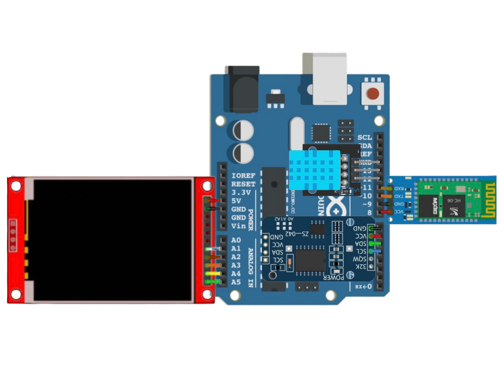

# Real-Time Clock (RTC)

This project involves the implementation of a real-time clock (RTC) using various electronic components and an Arduino Uno microcontroller.

## Project Components

1. **Arduino Uno**
   A microcontroller that handles all the logic and control of the project.

2. **RTC Module DS3231**
   A real-time clock module that ensures accurate time and date tracking. This module continues working even when powered off, thanks to its built-in battery.

3. **TFT LCD 2.2 SPI ILI9225**
   A display used for showing the time, date, temperature, and humidity.

4. **DHT11**
   A sensor for measuring temperature and humidity.

5. **Bluetooth Module HC-6**
   A module for wireless data transmission. It allows interaction with the project via a Bluetooth connection, such as updating the time or switching between displaying temperature in Celsius (°C) and Fahrenheit (°F).

### Commands for Interaction via Bluetooth Module HC-6:

- Send `C` to switch temperature display to Celsius (°C).
- Send `F` to switch temperature display to Fahrenheit (°F).
- Send `HH:MM:SS` to update the time to a new value.
- Send `DD:MM:YYYY` to update the date to a new value.

## Wiring Diagram

